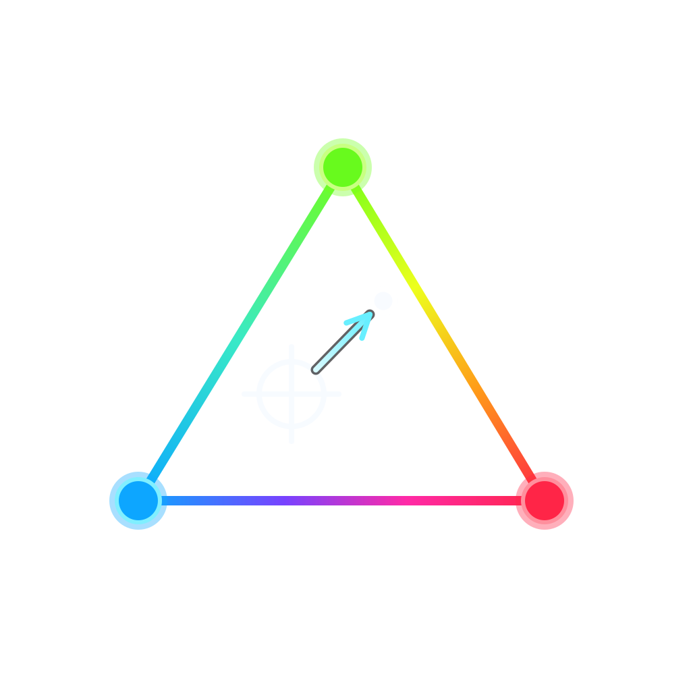

# tristim



A Rust toolkit for tristimulus colorimetry on Linux/Wayland: drivers
for USB display colorimeters, plus a standalone tool that validates
how a Wayland compositor actually reproduces color on each display.


tristim has two faces:

- **Reusable crates.** [`tristim-driver`](https://crates.io/crates/tristim-driver)
  (the colorimeter hardware layer) and
  [`tristim-display`](https://crates.io/crates/tristim-display) (the Wayland
  test-patch client) are published on crates.io, carry no compositor-specific
  or tool-specific assumptions, and are designed to be consumed standalone —
  e.g. by closed-loop display calibration tools.
- **A standalone compositor color-validation tool.** Point it at a display,
  let it drive test patches through the compositor's normal client path, and
  measure what the panel actually emits. It reports where color reproduction
  is faithful and where it drifts — white point across the brightness range,
  primaries and gamut, and EOTF/transfer response, for SDR and HDR
  (PQ / BT.2020 via `wp_color_management_v1`) alike.

It is compositor-agnostic by design: it asks for colors the way any client
would and measures the result, rather than side-channeling into a specific
output's scanout. That makes it an independent check on the color behavior a
compositor builds — including
[prism](https://github.com/computer-whisperer/prism), which consumes these
crates from its own `prism-tune` calibration tool. Any closed-loop
calibration lives in the consuming project, not here.

## Hardware support

| Product line | USB ID | Protocol | Status |
|---|---|---|---|
| Spyder 2024 | `085c:0a0b` | spydX2 | tested |
| SpyderX2 | `085c:0a0a` | spydX2 | should work, untested |
| Original SpyderX | `085c:0a00` | spydX | **untested port** |
| i1Display Pro / ColorMunki Display | `0765:5020` | i1d3 | tested (i1Display Pro) — covers the OEM rebadges too (NEC SpectraSensor Pro, HP DreamColor, …), which share the protocol but aren't each validated |

The wire protocols were reverse-engineered by Graeme Gill for ArgyllCMS
(`spectro/spydX2.c`, `spectro/spydX.c`, `spectro/i1d3.c`). The drivers here
are a Rust rework derived from that code (and licensed GPL-2.0-or-later to
match it — see [License](#license)), though they do not link ArgyllCMS.
Untested ports were written without hardware on hand; validation reports
are very welcome.
See [`tristim-driver/README.md`](tristim-driver/README.md) for details and
per-device notes.

## Workspace layout

The gather/present split runs through the whole workspace: tools that talk
to hardware record *facts only* (what the compositor advertised, what was
negotiated, code-value→measurement samples); interpretation happens
downstream against the recorded facts.

- [`tristim-driver/`](tristim-driver) — device-generic colorimeter layer; no
  Wayland dependency. A `Colorimeter` trait over the supported instruments
  (open one with `open_any()`), measurements as device-agnostic absolute-XYZ
  `Sample`s, per-measurement trust metrics (`MeasurementConfidence`), an
  adaptive-exposure primitive for batch loops, and an optional
  `RawDiagnostics` capability for sensor characterization.
- [`tristim-display/`](tristim-display) — Wayland layer-shell client that
  shows solid-color test patches on a chosen output. Every RGB `wl_shm`
  buffer format, the full parametric `wp_color_management_v1` surface, and
  an optional centered-window mode for ABL-limited OLED peak measurement.
  Code values go into the buffer verbatim; the crate is the workspace's
  authority on which color representations a compositor can be asked for.
- `tristim-capture/` — serde schema for capture files: the on-disk contract
  between the gatherer and the analysis/presentation tools. No heavy deps.
- `tristim-color/` — pure color science (color spaces, transfer functions,
  ICtCp, error metrics) used to interpret captures.
- `tristim-analyze/` — turns a capture into a verdict: derives the expected
  output for each trial from the negotiated color description and scores how
  far each measurement landed from it.
- `tristim-gather/` — capture orchestration shared by the CLI and GUI:
  drives a colorimeter and a patch surface through format × color-sequence
  sweeps, reporting progress through an event callback.
- `tristim-cli/` — the gatherer binary `tristim`. Subcommands for output
  enumeration, one-shot measurement, sensor characterization
  (`characterize`, `speed`, `integration`), gamut probing, capture
  sessions, capture analysis (`report`), and export (`export` — CGATS
  `.ti3` per trial for the ArgyllCMS/DisplayCAL toolchain, e.g. `colprof`
  to build an ICC profile, or flat CSV). `tristim help` has the full
  option set.
- [`tristim-gui/`](tristim-gui) — graphical front end: capture-setup form,
  live capture progress, and visualization of analyzed captures
  (chromaticity field with error vectors, luminance response, aggregate
  stats). Carries the workspace's heaviest dependency tree (damascene →
  wgpu/winit); `cargo run -p tristim-gui` (see its README).

`tristim-driver` and `tristim-display` are published on crates.io; the other
crates are internal libraries behind the two applications. The applications
ship together as one Arch package — see
[`packaging/`](packaging) for the AUR `PKGBUILD` (both binaries, the udev
rule, and the desktop entry) and the release checklist.

## How the tool talks to the compositor

`tristim-display` is an ordinary Wayland client. It writes code values into
a `wl_buffer` and commits it on a layer-shell surface — exactly the path any
application's content takes. For HDR it declares a parametric
`wp_color_management_v1` description (e.g. PQ + BT.2020 + mastering
metadata) so the compositor treats the buffer as already-encoded HDR
content.

This is deliberate: the tool measures what the compositor legitimately does
with a client's color request, so the resulting characterization is an
honest check on the compositor's pipeline rather than a measurement of a
bypassed one.

## Requirements

- Linux, and a Wayland compositor that implements `wlr-layer-shell`
  (wlroots-based compositors and KDE Plasma do; GNOME does not).
- For HDR and color-managed measurements, the compositor must additionally
  implement `wp_color_management_v1`. SDR-unmanaged captures work without it.
- A supported colorimeter from the table above.

## Installing

On Arch Linux, the [`tristim` AUR package](https://aur.archlinux.org/packages/tristim)
installs both binaries, the udev rule, and the desktop entry — no further
setup needed.

Elsewhere, build from source:

```sh
cargo build --release -p tristim-cli -p tristim-gui
# binaries land in target/release/{tristim,tristim-gui}
```

then install the udev rule by hand:

### udev rule

The colorimeters are vendor-class USB devices that need explicit access for
non-root users. From the repository root:

```sh
sudo cp 50-tristim.rules /etc/udev/rules.d/
sudo udevadm control --reload
# unplug + replug the colorimeter
```

After that the device is accessible to your logged-in user via
systemd-logind's `uaccess` tag — no group membership needed. (The AUR
package ships this rule already.)

## Affiliation

Unofficial. Not affiliated with, endorsed by, or sponsored by Datacolor or
X-Rite. "Spyder", "SpyderX", "SpyderX2", and "Spyder 2024" are Datacolor's
trademarks; "i1Display" and "ColorMunki" are X-Rite's. All are referenced
here only to identify supported hardware.

## License

Dual MIT / Apache-2.0, with one exception: `tristim-driver` is
GPL-2.0-or-later, as it is derived from the
[ArgyllCMS](https://www.argyllcms.com/) instrument drivers (Copyright
2006&ndash;2014 Graeme W. Gill). Since every binary links the driver,
distributed binaries are governed by the GPL.
